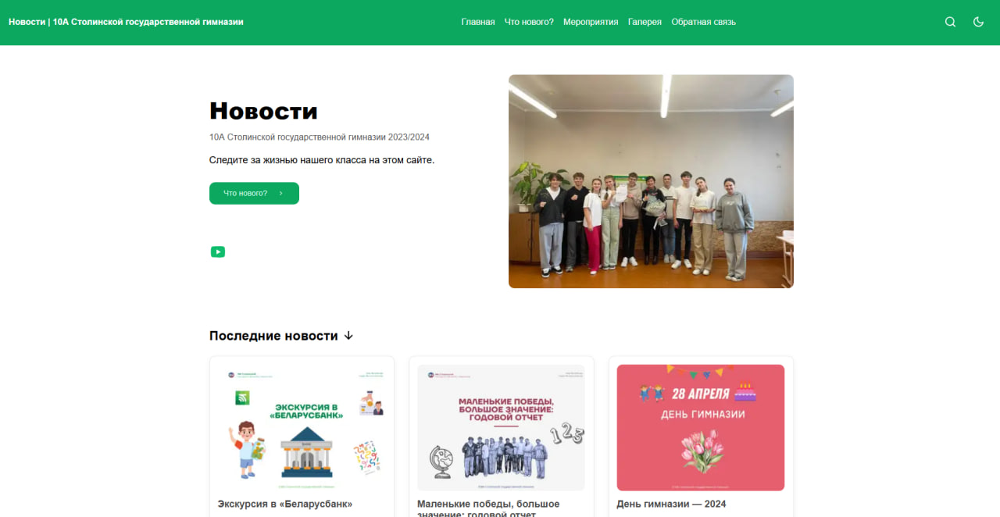

 &nbsp;

# Новости 10А Столинской государтсвенной гимназии

2023/2024 учебный год

## Основные функции
 📰 Новости и события: Последние новости.
 📅 Расписание мероприятий: расписание мароприятий в классе за прошедший год.
 📸 [Галерея](https://images-10a-stolin.vercel.app/): Фотографии с мероприятий и школьной жизни.
 📬 Обратная связь: связь с учителями и администрацией.
## Технологии
HTML5 & CSS3: Основные технологии для создания структуры и стилей сайта.
JavaScript: Для интерактивных элементов и улучшения пользовательского опыта.
Bootstrap: Для адаптивного дизайна и удобства использования на различных устройствах.
## Как внести вклад
Мы приветствуем вклад от всех участников! Если у вас есть идеи или предложения по улучшению сайта, пожалуйста, создайте issue или отправьте pull request.
